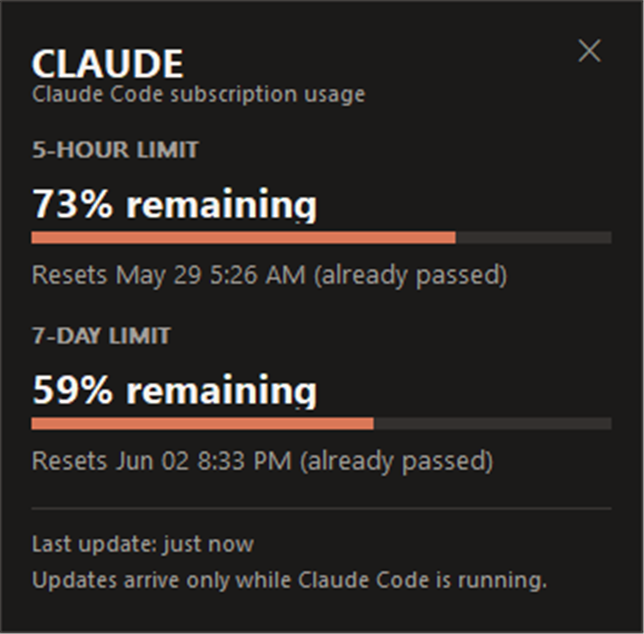
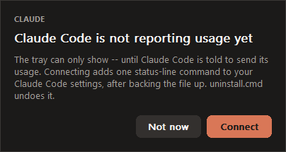

# ClaudeWeekUsageTray

Claude Code のサブスクリプション利用枠が、あとどれだけ残っているかを表示する
小さな Windows トレイプログラムです。

 &nbsp;&nbsp;


通知領域の数字は **5 時間枠の残り割合**です。クリックすると、2 つの枠と
それぞれのリセット時刻を並べたパネルが開きます。

他の言語で読む: [English](README.md) · [한국어](README.ko.md) ·
[简体中文](README.zh-CN.md) · [Русский](README.ru.md)

## できること、そして決してしないこと

利用状況を表示します。それだけです。

このプログラムが扱うデータは、Claude Code がすでにステータスラインコマンドへ
渡している 4 つの数値だけです。5 時間枠と 7 日枠の使用率、そして各リセット時刻
です。

次のことは **しません**:

- `~/.claude/.credentials.json`、Windows 資格情報マネージャー、ブラウザーの
  保存領域、環境変数の API キーを読みません
- OAuth トークン、セッション ID、会話ログを読むことも保存することもしません
- `api.anthropic.com` をはじめ、いかなるネットワークサービスも呼びません
- 更新プログラム、スタートアップ登録、テレメトリ送信を組み込みません

ログイン手順はありません。ログインする相手がないからです。サインインは Claude
Code が担当し、このプログラムは Claude Code が送ってくる数値を受け取るだけです。
境界の全容と、それを自分で検証する方法は [SECURITY.md](SECURITY.md) にあります。

## 動作要件

- Windows 10 または 11、64 ビット
- Claude Code がインストール済み、サインイン済みで、実際に動いていること

利用状況は Claude Code が動いている間にしか届きません。Claude Code を閉じている
間は何も自動更新されません。このプログラムはその事実を隠さず、そのまま表示します。

## インストール

1. リリースの ZIP をダウンロードし、そのまま置いておく場所に展開します。
   例: `C:\Tools\ClaudeWeekUsageTray`。中身は `ClaudeWeekUsageTray.exe` と
   `uninstall.cmd` の 2 つだけです。
2. 同じリリースにある `SHA256SUMS-v*.txt` と照合します。

   ```powershell
   Get-FileHash .\ClaudeWeekUsageTray.exe -Algorithm SHA256
   ```

3. `ClaudeWeekUsageTray.exe` を実行します。

   利用状況を送るよう Claude Code に伝える必要があるため、プログラムは起動時に
   その設定があるかを確認し、なければこう尋ねます。

   

   **Connect** を選ぶと、設定ファイルをバックアップしたうえで設定を書き込みます。
   すでに独自のステータスラインコマンドを使っている場合は先にそれを伝え、その
   コマンドはそのまま動き続けます。

4. Claude Code を使います。ステータスラインが描画された時点で — メッセージを
   1 つ送ればすぐに — 数字が現れます。

最初のデータが届くまで、トレイは `--` を表示します。エラーではなく、ありのままの
状態です。

設定を自分で行いたい場合や、スクリプト化したい場合は、確認なしで同じことをする
コマンドがあります。

```powershell
.\ClaudeWeekUsageTray.exe --setup
```

Claude Code は実行すべきパスを保存するので、フォルダーを移動すると接続が切れます。
移動先で起動すればそれに気づき、新しい場所を指すよう提案します。新しいリリースを
別のフォルダーに展開したときも同じ確認が出ます。ただし **実行中のコピーをメニューの
Exit で先に終了**してください。そうしないと、新しいコピーはウィンドウを出さずに
実行中のコピーのパネルを開くだけになります。

### 実行ファイルにコード署名はありません

実行ファイルは署名されていません。初回実行時に Windows SmartScreen の警告が出ます。
それが受け入れられない場合は、`build.cmd` で自分でビルドしてください。ビルドに必要
なのは Visual Studio の C++ ツールだけです。

## アイコンを見えるようにする

Windows 11 は新しいトレイアイコンを既定でシェブロンの奥に隠します。固定するには:

**設定 → 個人用設定 → タスク バー → 表示されていないシステム トレイ アイコン** で
**ClaudeWeekUsageTray** をオンにします。

それまでは、時計の横の `^` をクリックすると開く一覧の中にあります。

## 使い方

| 操作 | 結果 |
| --- | --- |
| アイコンを左クリック | 詳細パネルの表示 / 非表示 |
| アイコンを右クリック | **Show panel** と **Exit** のメニュー |
| プログラムを再度実行 | すでに実行中のコピーのパネルを開きます |
| パネルを閉じる | パネルだけ隠れます。プログラムは動き続けます |
| メニューの **Exit** | プログラムを終了します |

パネルには 2 つの枠の残り割合、それぞれのリセット時刻、そして数値が最後に届いた
時点が表示されます。しばらく何も届いていない場合はその旨をはっきり示し、トレイの
数字が薄くなります。古い数値を、たった今取得したもののように見せることはありません。

## すでにステータスラインを使っている場合

Claude Code が許すステータスラインコマンドは 1 つだけなので、追加は本質的に
上書きになります。起動時のウィンドウはそのことを伝え、何かに触れる前に確認します。
`--setup` はきっぱり断り、何をしようとしたかだけを示します。

```powershell
.\ClaudeWeekUsageTray.exe --setup
```

既存のコマンドを残したままトレイを併用するには:

```powershell
.\ClaudeWeekUsageTray.exe --setup --wrap-existing
```

既存のコマンドはそのまま実行され、まったく同じ入力を受け取り、出力も変更されずに
そのまま表示されます。加えて 4 つの数値だけがトレイへ転送されます。元のコマンドは
元に戻せるよう記録されます。

どちらの場合も、書き込みの前に `settings.json` が
`settings.json.cwut-backup-<日時>` としてバックアップされ、`padding` など他の
キーもそのまま保持されます。

元に戻すには:

```powershell
.\ClaudeWeekUsageTray.exe --remove-statusline
```

`statusLine` の項目がこのプログラムの認識しない形式だった場合は、何も変更せず、
手作業で追加すべき内容を出力します。

## 重複したトレイ項目の整理

Windows は実行ファイルのパスごとに通知領域の項目を覚えています。そのため、
プログラムを移動したり再ビルドしたりすると、設定の一覧に古い項目が残ることが
あります。確認するには:

```powershell
.\ClaudeWeekUsageTray.exe --cleanup-tray-icons
```

古い項目を削除するには:

```powershell
.\ClaudeWeekUsageTray.exe --cleanup-tray-icons --apply
```

これが触れるのは `HKEY_CURRENT_USER\Control Panel\NotifyIconSettings` だけ、
実行ファイルが `ClaudeWeekUsageTray.exe` の項目だけ、そして現在のユーザー
アカウントの中だけです。先に `.reg` バックアップを書き出すので元に戻せますし、
ファイルを削除することは一切ありません。

## アンインストール

```powershell
.\uninstall.cmd
```

トレイアイコンを終了し、ステータスラインの設定を元の状態に戻し、このプログラムの
通知領域の項目を `.reg` バックアップを残したうえで整理します。ファイルは削除しない
ので、フォルダーはご自身で削除してください。バックアップも不要であれば
`%LOCALAPPDATA%\ClaudeWeekUsageTray` も削除してください。

ほかに残るものはありません。インストーラーもサービスもなく、トレイプログラムなら
Windows が必ず作る通知領域の項目以外にレジストリキーもありません。

## ソースからのビルド

```powershell
.\build.cmd
.\build\ClaudeWeekUsageTray.exe --self-test
pwsh -File .\tools\security-scan.ps1
```

Visual Studio 2019 以降と **C++ によるデスクトップ開発** が必要です。ほかに依存
関係はありません。ネイティブ Win32 と C++17、静的 CRT、.NET なし、サードパーティ
ライブラリなし。すべてが 1 つの実行ファイルにリンクされます。`build.cmd clean` で
出力を消せます。

リリース ZIP と `SHA256SUMS-v*.txt` を作るには:

```powershell
pwsh -File .\tools\package.ps1
```

## 仕組み

Claude Code は描画のたびに `statusLine` コマンドを実行し、JSON データを標準入力へ
流します。そのコマンドが、この同じ実行ファイルを
`ClaudeWeekUsageTray.exe --statusline` として起動したものです。このモードでは
データから 4 つの数値だけを取り出し、動作中のトレイへループバック TCP で送ります。
この接続は、現在のアカウントだけが読めるファイルに保存された 256 ビットのトークンで
保護されています。データのそれ以外の部分は、読まれることも、保持されることも、
転送されることもありません。

手元で試すときの注意が 1 つあります。PowerShell は GUI サブシステムのプログラムを
待たないため、`echo '{...}' | .\ClaudeWeekUsageTray.exe --statusline` は出力が届く
前にプロンプトが戻ります。Claude Code はパイプを正しく読みます。自分の目で確かめる
なら `cmd /c` を通して実行してください。

この仕組みはイベント駆動です。Claude Code が何かを送ったときにだけ更新されます。
トレイ内の 30 秒タイマーは、すでに持っている値を描き直すだけです。数字が薄くなり、
文言が「古い」に変わるタイミングを合わせるためのもので、何かを取りに行くわけでは
ありません。

残りは [DESIGN.md](DESIGN.md) に書いてあります。

## ライセンス

MIT。[LICENSE](LICENSE) を参照してください。
